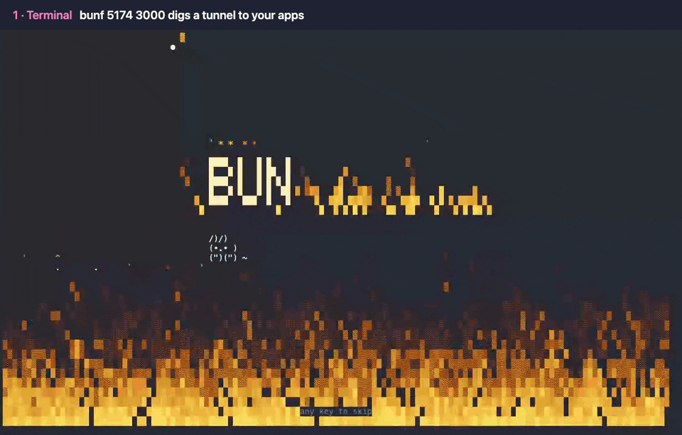

# bunflared



`bunflared 5173 3000` puts your local app on a temporary
`https://<words>.trycloudflare.com` link, through a Cloudflare quick tunnel.
No account, no deploy. Send the link to a client, open it on your phone,
close the terminal and it is gone.

It shares several ports behind one link, so a frontend and its API travel
together: the first port is served at `/`, the others under `/_port/<port>`,
and `http://localhost:<port>` inside your pages and scripts is rewritten to
match. WebSockets pass through, so hot reload keeps working for the person on
the other end.

And it is a show. A bunny digs the tunnel while DNS catches up, the link lands
in a burst of confetti, every request flies across a traffic lane, the bunny
naps when nobody visits and panics on a 5xx. There are achievements. There are
secrets.

## Install

macOS and Linux:

```sh
curl --proto '=https' --tlsv1.2 -LsSf https://github.com/mirkobozzetto/bunflared/releases/latest/download/bunflared-installer.sh | sh
```

Windows (PowerShell):

```powershell
powershell -ExecutionPolicy Bypass -c "irm https://github.com/mirkobozzetto/bunflared/releases/latest/download/bunflared-installer.ps1 | iex"
```

That is all: no Rust, no `cloudflared` to install first. You get `bunflared`
and its short name `bunf`. On the first share, bunflared downloads
Cloudflare's own `cloudflared` if it is not already installed.

From source, with Rust: `cargo install --git https://github.com/mirkobozzetto/bunflared`.

Then, once, so your coding agents know to reach for it when you ask to share
something:

```sh
bunflared agents
```

## Use

```sh
bunf 5173                       # share one app
bunf 5173 3000                  # app at /, its API at /_port/3000
bunf 5173 --calm                # same dashboard, no animations
```

`bunf` and `bunflared` are the same command.

In the dashboard:

| Key | Does |
| --- | --- |
| `c` | copy the link (it is already in your clipboard) |
| `o` | open it in your browser |
| `r` | big QR code, for phones |
| `f` | fireworks |
| `?` | help |
| `q` | stop sharing |

`NO_COLOR` is respected. When a shared port stops answering, visitors get a
small bunny page that retries by itself.

## For AI agents

Outside a terminal, or with `--json`, there is no dashboard: one JSON line on
stdout once the link works, one on stderr if it fails, and a meaningful exit
code. `--detach` returns as soon as the link works and keeps sharing in the
background.

```sh
bunflared 5173 3000 --detach    # {"id":"4242","url":"https://...","routes":{...},...}
bunflared ls --json
bunflared down 4242             # or: bunflared down --all
```

### Teach your agents

`bunflared agents` writes a five-line note into the global instructions of
every coding agent it finds, so any session knows the command without being
told:

| Agent | Where the note goes |
| --- | --- |
| Claude Code | `~/.claude/rules/bunflared.md` |
| omp | `~/.omp/agent/rules/bunflared.md` |
| pi | `~/.pi/agent/AGENTS.md`, in a marked block |
| prime-agent | `~/.prime/agent/AGENTS.md`, in a marked block |
| Codex | `~/.codex/AGENTS.md`, in a marked block |

Run it again after an update to refresh the note, `bunflared agents --remove`
to take it back out. For any other agent, paste the output of
`bunflared agents --print` into its rules.

Prefer skills? `skills/bunflared/SKILL.md` follows the Agent Skills format, and
[skills](https://github.com/vercel-labs/skills) installs it into Claude Code,
Codex, Cursor, pi and many more in one line:

```sh
npx skills add mirkobozzetto/bunflared -g
```

## Limits

- Anyone with the link reaches your dev server. The random name is the only
  protection.
- Quick tunnels allow 200 requests in flight and do not carry Server-Sent
  Events ([Cloudflare docs](https://developers.cloudflare.com/cloudflare-one/networks/connectors/cloudflare-tunnel/do-more-with-tunnels/trycloudflare/)).
- Quick tunnels refuse to start while `~/.cloudflared/config.yaml` exists.
- Tested by hand on macOS. The Linux and Windows builds compile in CI but
  have not been tried by hand yet.

## License

MIT
