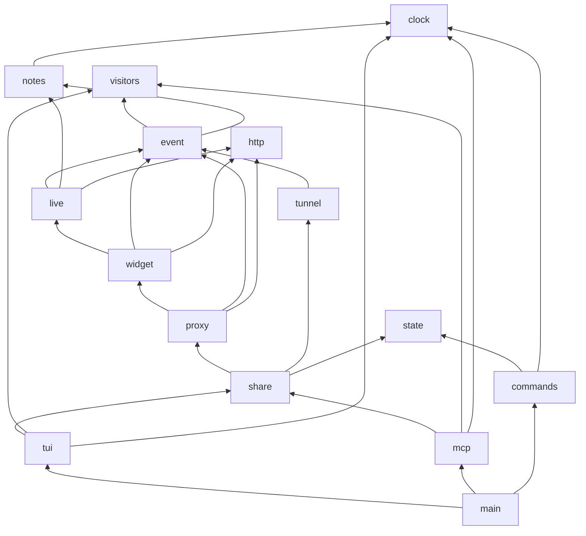

# 0001 : Des modules qui dépendent dans un seul sens, un dashboard découpé

## 1. Résumé

Problème : les types partagés (événements, requêtes, visiteurs) vivent dans
les modules qui font le transport, si bien que `share`, `live`, `widget`,
`proxy` et `tunnel` s'importent tous en boucle. Le dashboard tient tout dans un
objet `App` d'environ 70 champs. Le serveur MCP, arrivé en dernier, a dû
recopier des règles du dashboard (points R04 à R07, R13 et R14 de
`docs/review/2026-10-02-codebase/report.md`).

Recommandation : sortir les données et les règles partagées dans cinq petits
modules sous le transport (`http`, `clock`, `event`,
`visitors`, `notes`), puis découper `App`, `mcp/host.rs` et `state.rs`. Huit
étapes, chacune compile, ne change aucun comportement visible et se commite
seule.

Impact : le prochain chantier (« l'agent voit la page ») touche un module de
domaine et deux interfaces au lieu de trois fichiers enchevêtrés. Aucune
sortie, aucun format, aucune dépendance ne change.

## 3. Problème et motivation

Le découpage par fichier suit de vrais rôles, mais les dépendances vont dans
tous les sens. Relevé sur `main` le 2026-10-02 :

| Module | Lignes | Importe |
| --- | --- | --- |
| `share.rs` | 260 | `live`, `proxy`, `widget`, `tunnel`, `state`, `cloudflared`, `clipboard`, `os` |
| `live.rs` | 380 | `share`, `proxy`, `widget` |
| `widget.rs` | 374 | `share`, `live`, `proxy` |
| `proxy.rs` | 446 | `share`, `live`, `widget` |
| `tunnel.rs` | 174 | `share`, `os` |
| `tui/mod.rs` | 1276 | `share`, `live`, `proxy`, `widget`, `state`, `clipboard`, `os` |
| `mcp/host.rs` | 653 | `share`, `live`, `proxy`, `widget`, `state` |

Six paires s'importent mutuellement : `share` et `live`, `share` et `proxy`,
`share` et `widget`, `share` et `tunnel`, `live` et `widget`, `widget` et
`proxy`. Rust l'accepte, mais aucun module ne se lit seul : `Event` est défini
dans `share.rs`, `Hit` y porte `proxy::Exchange`, `Presence` vit dans le
module HTTP du widget, et le journal de session s'écrit depuis le hub
WebSocket.

Le coût est déjà visible. La PR #5 a recopié dans `mcp/host.rs` la règle du
rejeu, la normalisation des chemins, l'horloge et le suivi des visiteurs du
dashboard. Il a fallu une revue pour fusionner trois de ces copies, et le suivi
des visiteurs reste en double (`tui::Session` et `mcp::host::Seen`).

Côté dashboard, `App` mélange la progression du lancement, les statistiques
de trafic, les visiteurs et le chat, la saisie et une vingtaine d'états
d'animation. `on_key` fait 186 lignes et passe des codes secrets au
presse-papier. Chaque ajout au dashboard passe par ces deux endroits.

## 4. Objectifs et non-objectifs

Objectifs :

- Le graphe des modules est sans cycle : chaque module ne dépend que de
  modules plus bas que lui (section 6).
- Une règle métier (statut d'un visiteur, arrivée et départ, rejouabilité,
  chemin de page, format d'heure) a une seule implémentation, que le
  dashboard et le serveur MCP appellent.
- `App` est composé de parties nommées, chacune avec ses méthodes. `on_key`
  devient un aiguillage de moins de 40 lignes.
- `widget.rs` ne garde que les routes HTTP du widget, `state.rs` que les
  fiches de partage, `mcp/host.rs` que le registre et le cycle de vie des
  partages.

Non-objectifs :

- Aucun comportement visible ne change : sorties JSON de `ls`, `--json` et
  `--detach`, outils MCP, dashboard, widget, fichiers de notes.
- Aucune nouvelle dépendance, aucun découpage en plusieurs crates.
- Les animations (`fx`, `shaders`, `scenes`, `spectacle`, `art`) ne sont pas
  refaites : elles changent seulement de propriétaire.
- `src/widget.js` n'est pas touché.
- Les issues #7, #8 et #9 ne sont pas traitées ici.

## 5. Alternatives envisagées

| Option | Ce que ça coûte | Pourquoi pas |
| --- | --- | --- |
| Statu quo | rien aujourd'hui | chaque fonctionnalité qui touche le dashboard et le MCP recopie une règle ou traverse le cycle ; ça s'est produit dès la première |
| Découper les gros fichiers seulement | une demi-journée | `tui/mod.rs` devient quatre fichiers, mais les cycles et le suivi des visiteurs en double restent : le problème change de place |
| Modules de domaine en bas du graphe, puis découpage (retenu) | deux à trois jours en huit étapes | voir section 6 |
| Remplacer le bus `Event` par un canal par domaine, ou par des traits d'observateur | une semaine, des changements de signature partout | trois consommateurs (dashboard, MCP, ligne JSON) qui filtrent chacun un sous-ensemble se lisent très bien avec une énum ; le défaut, c'est où elle vit, pas sa forme |
| Plusieurs crates dans un workspace (`core`, `tunnel`, `tui`, `mcp`) | une semaine, changement de la publication crates.io et de `dist` | le compilateur garantirait les frontières, mais rien ne demande aujourd'hui de publier un morceau seul |

## 6. Conception retenue

### Graphe cible

Plus aucune flèche ne remonte. `http`, `clock` et `visitors` n'importent que
`std`, `hyper`, `serde` et `chrono` ; `notes` et `event` n'ajoutent que les
modules du bas.

### Les cinq modules du bas

| Module | Contient | Vient de |
| --- | --- | --- |
| `http.rs` | `Body`, `full`, `status`, `plain`, `html`, `json` | `proxy.rs`, `widget.rs` |
| `clock.rs` | `stamp`, `clock`, `uptime` | `widget.rs`, `state.rs` |
| `event.rs` | `Event`, `Tx`, `Failure` et les codes de sortie, `Hit` et `unreplayable`, `Exchange`, `Capture` et `readable`, `Said`, `Pointer`, `Reacted`, `Feedback` | `share.rs`, `proxy.rs`, `live.rs`, `widget.rs` |
| `visitors.rs` | `Presence` et `status`, `device()`, `Roster` | `widget.rs`, `tui::Session`, `mcp::host::Seen` |
| `notes.rs` | `FOLDER`, `folder_ready`, `Element` et `markdown`, `save_note`, `save_shot`, `Transcript` (le journal `session_<date>.md`) | `widget.rs`, `live::Hub::keep` |

`Roster` est le suivi des visiteurs, écrit une fois : `update(presence)`
répond « arrivé » ou rien, `departures()` rend ceux qui sont partis,
`here()` les présents dans l'ordre d'arrivée, et le plafond de 200 visiteurs
s'y applique. Le dashboard garde à côté sa table des pointeurs, la seule
donnée qu'il ajoute.

`Transcript` reprend l'écriture du journal de session. Le `Hub` le possède
et ne fait plus que les WebSockets.

### Les découpages

- `state.rs` garde `Record`, `Saved`, `recorded` et la lecture des fiches.
  `ls`, `down` et `--detach` passent dans `commands.rs`, à côté de
  `agents.rs`.
- `mcp/host.rs` garde `Host` : le registre, l'ouverture, la fermeture et
  la traduction des événements. Le journal à curseur et l'attente passent
  dans `mcp/journal.rs`. `Share`, ses actions et ses vues JSON passent dans
  `mcp/share.rs`, qui utilise `Roster`.
- `App` devient un assemblage de parties, chacune dans son fichier sous
  `tui/` :

| Partie | Champs repris d'`App` | Méthodes |
| --- | --- | --- |
| `Boot` | `ports`, `url`, `record`, `qr_code`, `resolved`, `copied`, `progress`, `target`, `stage`, `ready_at`, `failure` | progression du lancement |
| `Traffic` | `rows`, `total`, `classes`, `visitors` (adresses), `sockets`, `ms_sum`, `per_second`, `bucket_at`, `last_hit`, `last_error`, `details`, `details_scroll` | `record(hit)` rend les paliers atteints, `replayed()` |
| `Audience` | `Roster`, pointeurs, `chat`, `pages`, `reactions`, `feedback`, `selected`, `picked`, `hub`, `replayer` | présence, chat, commandes aux pages |
| `Show` | `rng`, `particles`, `fire`, `inferno`, `spectacle`, `shaders`, `spots`, `sprites`, `toasts`, `runners`, `launch_bursts`, `disco`, `fireworks`, `carrots_until`, `worried_until`, `unlocked`, `keep_clear` | `toast`, `unlock`, `celebrate`, `stampede` |
| `Keys` | `focus`, `prompt`, `keys`, `typed`, `b_presses`, `help`, `qr`, `quitting` | une fonction par mode : quitter, codes secrets, détail d'une requête, commandes, saisie |

`App` garde le thème, la phase et l'horloge des animations, plus ces cinq
parties. `on_event` aiguille chaque événement vers sa partie et relie les
deux seuls croisements : un palier de trafic débloque un succès dans
`Show`, une réaction lance son animation. Les fonctions de dessin
(`dashboard.rs`, `scenes.rs`) lisent `app.traffic.rows` au lieu de
`app.rows` : le changement y est mécanique.

## 7. Inconvénients et risques

- **Aucun test automatique dans le dépôt.** Le risque principal est une
  régression silencieuse du dashboard. Parade : à chaque étape, `cargo
  clippy` sans avertissement, le scénario MCP de 29 vérifications, une
  comparaison des sorties `ls --json`, `--json` et `--detach` avant et après,
  et un passage du dashboard en `--calm` dans herdr pour les étapes T08.
- **Gros diff mécanique dans `dashboard.rs`** (1146 lignes) à l'étape T08 :
  surtout des chemins de champs. À faire d'une traite, sans autre travail en
  parallèle sur `tui/`.
- **Conflits avec les issues #7 à #9** : #7 touche `proxy.rs`, #9 touche
  `mcp/mod.rs`. Elles passent avant ou après, jamais pendant.
- **Question ouverte, à trancher avant T01** : le scénario MCP de 29
  vérifications n'existe que dans un dossier temporaire. Je propose de le
  verser dans le dépôt (`scripts/mcp-smoke.ts`, lancé avec `bun`) comme
  filet pour cette refonte. C'est un test nouveau, donc à ton accord.

Retour arrière : chaque étape est un commit qui se revert seul.

## 9. Recommandation et justification

Prendre l'option retenue, après la sortie de la 0.3.0. La version embarque
déjà les corrections de la revue ; la refonte ne change aucun comportement,
elle n'a donc aucune raison de la retarder.

L'ordre compte : les modules du bas d'abord (T01 à T05), parce qu'ils cassent
les cycles sans toucher au dashboard et rendent les découpages suivants
mécaniques. `visitors` et `notes` passent avant `event`, qui contient leurs
types. `App` en dernier, quand `Roster` et `event.rs` existent déjà.

Confiance : haute pour T01 à T07, qui déplacent du code sans le réécrire.
Moyenne pour T08, faute de tests sur le dashboard.

À revoir si le dashboard doit un jour tourner sans terminal (dans le
navigateur, par exemple) : il faudrait alors séparer `Audience` et
`Traffic` de `tui/` pour de bon, et la question des crates reviendrait.

## 10. Plan d'implémentation

Boundary : possède `src/` sauf `src/widget.js` ; ne touche pas
`Cargo.toml` (dépendances), `.github/`, `dist-workspace.toml`, `docs/demo/`.

| ID | Title | Files | Depends on | Effort |
| --- | --- | --- | --- | --- |
| T01 | `http.rs`: response builders in one leaf module | `src/http.rs`, `proxy.rs`, `widget.rs`, `live.rs` | - | XS |
| T02 | `clock.rs`: stamp, clock, uptime | `src/clock.rs`, `widget.rs`, `state.rs`, `live.rs`, `tui/`, `mcp/` | - | XS |
| T03 | `visitors.rs`: Presence, status, device, Roster used by mcp | `src/visitors.rs`, `widget.rs`, `mcp/host.rs`, `tui/` | - | S |
| T04 | `notes.rs`: feedback folder, Element, notes, shots, Transcript out of Hub | `src/notes.rs`, `widget.rs`, `live.rs` | T02 | S |
| T05 | `event.rs`: Event, Tx, Failure and exit codes, Hit, Exchange, Capture, Said, Pointer, Reacted, Feedback | `src/event.rs`, `share.rs`, `proxy.rs`, `live.rs`, `widget.rs`, `tunnel.rs`, `main.rs`, `tui/`, `mcp/` | T01, T03, T04 | S |
| T06 | `commands.rs`: ls, down, detach out of state.rs | `src/commands.rs`, `state.rs`, `main.rs` | T02 | XS |
| T07 | mcp split: journal.rs, share.rs, host.rs | `src/mcp/` | T05 | S |
| T08 | App split: Boot, Traffic, Audience (on Roster), Show, Keys | `src/tui/` | T05 | L, one commit per part |

Verification for every task: `cargo build` and `cargo clippy --all-targets`
clean; no module imports one above it in the graph of section 6 (checked by
listing `crate::` imports per file); the 29-check MCP scenario passes;
`ls --json`, `--json` and `--detach` outputs identical to `main`. T04 also
checks a note and `session_<date>.md` written by a real browser; T08 also
runs the dashboard in `--calm` and with animations, with a visitor, a chat
message, a replay and `q`.
